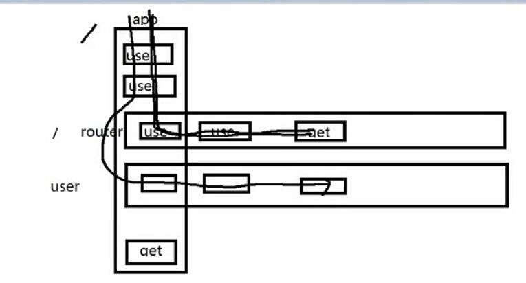

# 生成文件说明
- app.js:express的主要配置文件
- package.json:存储着工程的信息及模块依赖,在=当在dependencies中添加依赖的模块时,运行`npm install`,npm会检查项目下的package.json并自动安装指定的模块
- node_modules:存放package.json中安装的模块,当你在package.json添加依赖的模块并安装后,存放在这个文件夹下.
- public:存放image css js等文件
- routes:存放路由文件
- views:存放视图文件或者说模板文件
- bin:可执行文件,可以从此启动服务器

# 使用 SET PORT=4212  修改端口号

### app.use()执行
